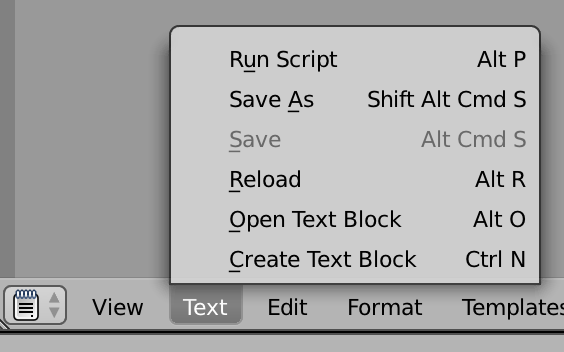
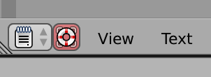
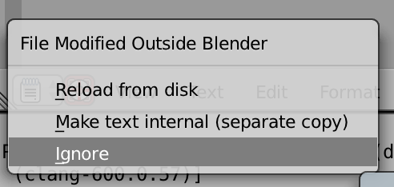

# Deployment & IDE

## Deployment
The idea of deployment is to provide way to start the game as a single file/app for the user to click and run the game without being presented with the blender tool.

When the game runs, it uses a lot of different ressources which need to be packed up together with the game.

* All the meshes, textures, sounds, material, scenes etc. That is, **the whole blend** file.
* An interpreter which can run the game engine - this program is called `blenderplayer`.
* A *python interpreter* and all the *python libraries* you might use.

In addition you want to produce an executable for the major operating systems.

### Missing platforms for blenderplayer
Blenderplayer runs an windows, mac and linux. That means it do not run on android, xbox or ios. Nor does it run in the browser.

## Using PyCharm for editing blender scripts

### Level 1 - using (any) external editor
Blender has two places to save its python files, inside the `.blend` file, and outside.

The default is that the files are stored in the blender file, and thereby saved together with everything else when you save the blender file.

In the text editor, there is a menu point "Save As" to save the python file:

Now the python file is saved in the normal filesystem, and you can edit it using any external text editor.

When you return to blender, the blender text editor will have this little lifesaver symbol in the lower left corner, and clicking it will bring up a menu that allow you to solve the issue:

Mostly you will need the "Reload from disk".

### Level 2 - Using PyCharm with completion
PyCharm need to know about the `bpy` and other blender libraries to enable completion. I do not know where they are on windows, they are in a subfolder named '.../scripts/modules'. 

It seems there is some info missing though, as for example all the bpy.types are not there. That seem to be a known issue, as there is a [github project to repair just that](https://github.com/nutti/fake-bpy-module/tree/master/premade_modules/2.79).

Using this method still require you to "reload from disk" as above, but now you can use pycharm in a better way.

## Deploying blender
One of the key usages of blender is to produce meshes, materials and uv-maps to be used in games and animations.

We have mostly used blender through its UI, but with our focus on scripting, it actually makes sense to use blender in *background mode*. The manual pages of blender lists all the various [command line arguments](https://docs.blender.org/manual/en/latest/advanced/command_line/arguments.html) you can use for blender. 

Examples could be:

* Creating many different staircases by script
* Creating 3D renderings of (scientific) data
* Creating physical simulations with different input parameters
* Creating different variations for 3D printing

Several ways also exist for publishing 3D models in browsers. There are many competing fileformats, each with different tradeoffs.

## Other files here
I tried but did not succeed in setting up pycharm to be able to debug python scripts in blender. Some left over files are hanging around. The pieces of information that seems to be useful are:

* Official info on how to use [remote debugging](https://www.jetbrains.com/help/pycharm/remote-debugging-with-product.html) with pycharm.
* A [somewhat dated blog entry](https://code.blender.org/2015/10/debugging-python-code-with-pycharm/).
